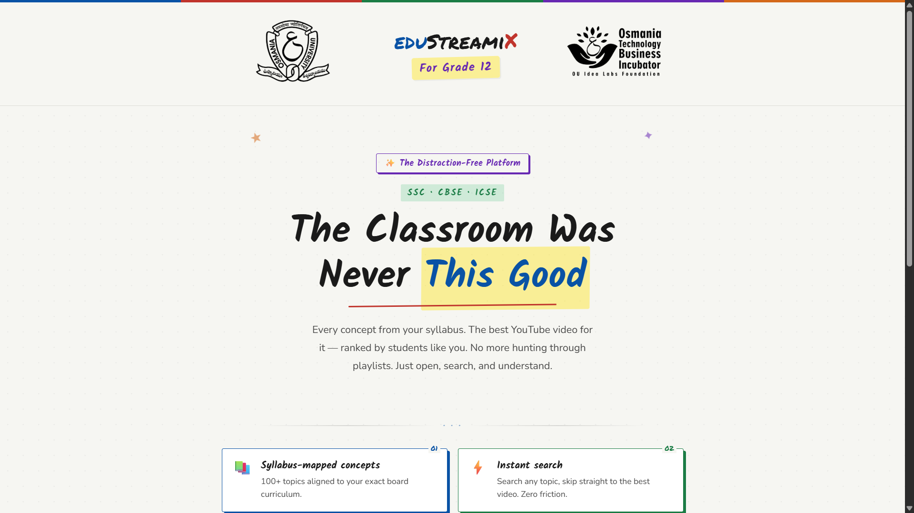
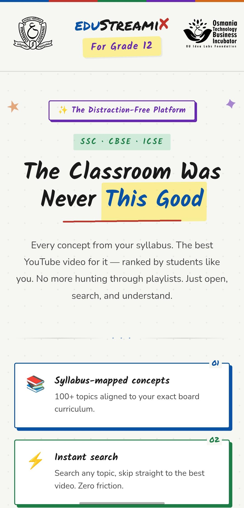
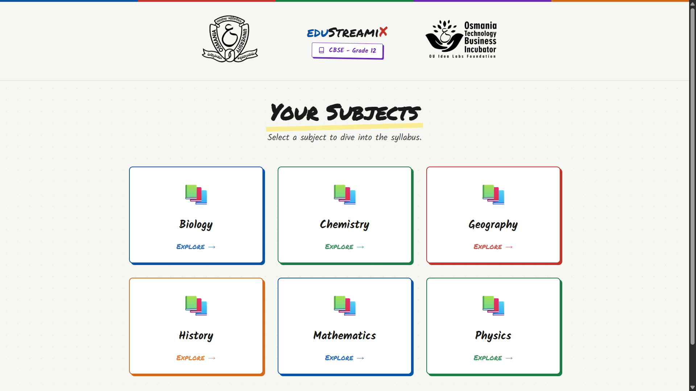
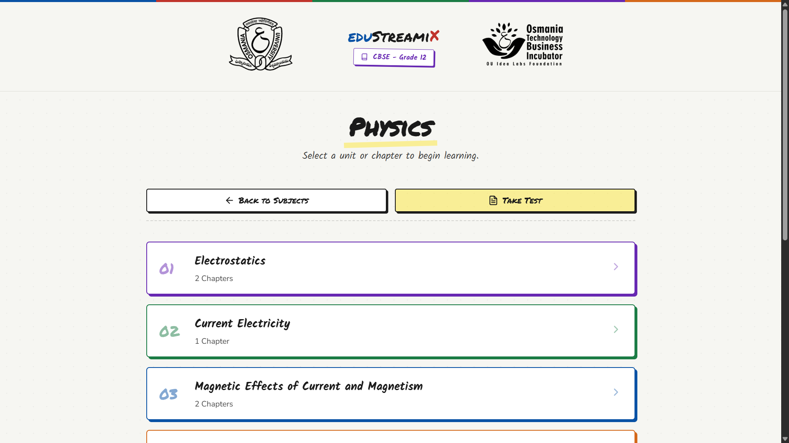
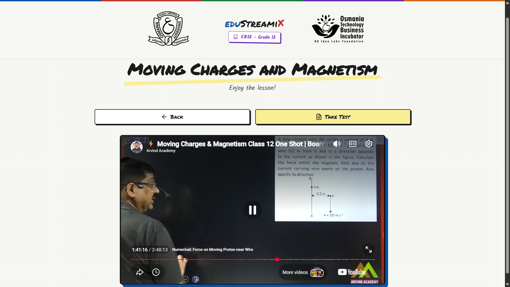
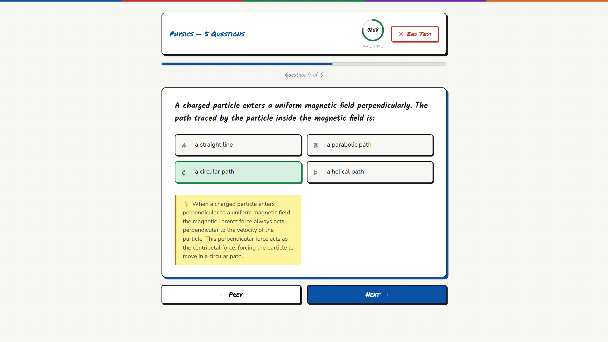

# 🎓 EduStreamiX  - Class 12

[](https://class-12-education.onrender.com/)

> A modern full-stack educational platform designed to deliver seamless distraction-free learning experiences.

EduStreamiX for Class 12 is a web application that provides students in grade 12 with organized study resources available on YouTube, and an AI-powered educational assistant through a premium and responsive interface. The platform integrates advanced animations, backend-driven rendering, and cloud-based resource management to create a next-generation learning environment. 

---

## 📌 Overview

The platform allows students to:

* Explore educational resources by their respective school educational board and subject
* Use AI-powered Practise Tests
* Enjoy a responsive interface across devices

---

## 📌 Features

* Modern UI/UX with glassmorphism and smooth animations
* Dynamic subject and study resource management
* Google Drive API Integration for resource fetching
* Google Generative AI integration for intelligent features
* Fully Responsive Design for desktop and mobile


---

## 🛠️ Tech Stack

**Frontend**
*  HTML5 / EJS
*  CSS3 (Vanilla)
*  Vanilla JavaScript

**Backend**
*  Node.js
*  Express.js

**Tools & Services**
*  Google Drive API (`googleapis`)
*  Google Generative AI (`@google/generative-ai`)
*  Dotenv

---

## 📸 Screenshots

### 🏠 Home Page

#### 🔹 Home — Hero Section


#### 🔹 Home — Mobile View


### 📚 Study

#### 🔹 Study — Subjects Section


#### 🔹 Study — Units Section


#### 🔹 Study — Watch Lesson


#### 🔹 Study — Practise Test


---

## ⚠️ Note on Local Execution

> **Important:** Because the application architecture relies heavily on specific, private Google Drive folder ID and associated Google Service Account credentials to fetch subject data and study resources dynamically, it **cannot be cloned and run out-of-the-box** by other users. 

---

## 📁 Project Structure

```text
📦 EduStreamiX
├── 📁 A) FrontEnd/               # Frontend assets and templates
│   ├── 📁 Images/                # Logos, UI assets, and backgrounds
│   ├── 📁 Markup(HTML)/          # EJS templates (home.ejs, study.ejs)
│   ├── 📁 Script(JS)/            # JavaScript files (home.js, study.js)
│   └── 📁 Style(CSS)/            # CSS Stylesheets (home.css, study.css)
│
├── 📁 B) BackEnd/                # Backend application
│   ├── 📁 src/
│   │   ├── 📁 controllers/       # Route controllers and logic
│   │   ├── 📁 routes/            # Express route definitions
│   │   ├── 📁 services/          # Google Drive and external services
│   │   ├── 📄 app.js             # Express application setup
│   │   └── 📄 index.js           # Server entry point
│   ├── 📄 package.json           # Backend dependencies
│   ├── 📄 package-lock.json      # Exact dependency versions
│   └── 📄 service-account.json   # Ignored Google credentials
│
├── 📄 .env                       # Environment variables
├── 📄 .gitignore                 # Ignored files
└── 📄 README.md                  # Project documentation
```

---

## 🔮 Future Improvements

* Student Authentication System
* Personalized Dashboards
* AI-based Study Recommendations
* Notes & Bookmarking System

---

## 👤 Author

**Anshumaan Sai Patnaik**

* GitHub:
  [Anshumaan Sai Patnaik GitHub](https://github.com/Anshumaan-Sai-Patnaik)

* LinkedIn:
  [Anshumaan Sai Patnaik LinkedIn](https://www.linkedin.com/in/Anshumaan-Sai-Patnaik)